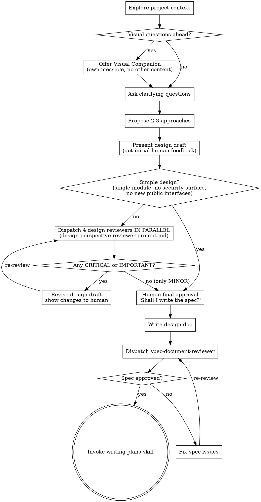

# Brainstorming Ideas Into Designs

Help turn ideas into fully formed designs and specs through natural collaborative dialogue.

Start by understanding the current project context, then ask questions one at a time to refine the idea. Once you understand what you're building, present the design and get user approval.

<HARD-GATE>
Do NOT invoke any implementation skill, write any code, scaffold any project, or take any implementation action until you have presented a design and the user has approved it. This applies to EVERY project regardless of perceived simplicity.
</HARD-GATE>

## Anti-Pattern: "This Is Too Simple To Need A Design"

Every project goes through this process. A todo list, a single-function utility, a config change — all of them. "Simple" projects are where unexamined assumptions cause the most wasted work. The design can be short (a few sentences for truly simple projects), but you MUST present it and get approval.

## Checklist

You MUST create a task for each of these items and complete them in order:

1. **Explore project context** — check files, docs, recent commits
2. **Offer visual companion** (if topic will involve visual questions) — this is its own message, not combined with a clarifying question. See the Visual Companion section below.
3. **Ask clarifying questions** — one at a time, understand purpose/constraints/success criteria
4. **Propose 2-3 approaches** — with trade-offs and your recommendation
5. **Present design draft** — in sections scaled to their complexity, get initial human feedback
6. **Multi-role design review** — if design has security surface, multiple modules, or new public interfaces: dispatch 4 parallel reviewers, iterate until ✅; otherwise skip (see Design Review Loop for scope gate)
7. **Human final approval** — present final design, ask "Shall I write the spec?" Wait for confirmation.
8. **Create worktree** — invoke `superpowers:using-git-worktrees` to create isolated workspace
9. **Write design doc** — save to `docs/superpowers/specs/YYYY-MM-DD-<topic>-design.md`
10. **Spec review** — dispatch spec-document-reviewer subagent, iterate until ✅, then commit
11. **Transition to implementation** — invoke writing-plans skill to create implementation plan

## Process Flow



**The terminal state is invoking writing-plans.** Do NOT invoke frontend-design, mcp-builder, or any other implementation skill. The ONLY skill you invoke after brainstorming is writing-plans.

## The Process

**Understanding the idea:**

- Check out the current project state first (files, docs, recent commits)
- Before asking detailed questions, assess scope: if the request describes multiple independent subsystems (e.g., "build a platform with chat, file storage, billing, and analytics"), flag this immediately. Don't spend questions refining details of a project that needs to be decomposed first.
- If the project is too large for a single spec, help the user decompose into sub-projects: what are the independent pieces, how do they relate, what order should they be built? Then brainstorm the first sub-project through the normal design flow. Each sub-project gets its own spec → plan → implementation cycle.
- For appropriately-scoped projects, ask questions one at a time to refine the idea
- Prefer multiple choice questions when possible, but open-ended is fine too
- Only one question per message - if a topic needs more exploration, break it into multiple questions
- Focus on understanding: purpose, constraints, success criteria

**Exploring approaches:**

- Propose 2-3 different approaches with trade-offs
- Present options conversationally with your recommendation and reasoning
- Lead with your recommended option and explain why

**Presenting the design:**

- Once you believe you understand what you're building, present the design
- Scale each section to its complexity: a few sentences if straightforward, up to 200-300 words if nuanced
- Ask after each section whether it looks right so far
- Cover: architecture, components, data flow, error handling, testing
- Be ready to go back and clarify if something doesn't make sense

**Security attack surface (required for any feature touching financial logic, external SDKs, public API, or cryptography):**

Include an explicit section in the design doc — this becomes the guard test checklist for `writing-plans`:

```markdown
## Security Attack Surface

| Input / Behaviour | Guard | Where |
|---|---|---|
| Amount rounds to zero | Zero-value guard, throw before any side effect | e.g. pay() before first RPC call |
| Payer == recipient | Self-transfer guard | e.g. pay() before ATA creation |
| SDK resolves but failed on-chain | Check result error field | e.g. after confirmTransaction() |
| Wrong-environment config | Startup guard, throw at construction | constructor |
| Output in HTTP headers/logs | Strip control characters | e.g. getAddress() |
```

Every row in this table → one failing test in the plan. If a guard isn't in the table, it won't be tested.

**Design for isolation and clarity:**

- Break the system into smaller units that each have one clear purpose, communicate through well-defined interfaces, and can be understood and tested independently
- For each unit, you should be able to answer: what does it do, how do you use it, and what does it depend on?
- Can someone understand what a unit does without reading its internals? Can you change the internals without breaking consumers? If not, the boundaries need work.
- Smaller, well-bounded units are also easier for you to work with - you reason better about code you can hold in context at once, and your edits are more reliable when files are focused. When a file grows large, that's often a signal that it's doing too much.

**Working in existing codebases:**

- Explore the current structure before proposing changes. Follow existing patterns.
- Where existing code has problems that affect the work (e.g., a file that's grown too large, unclear boundaries, tangled responsibilities), include targeted improvements as part of the design - the way a good developer improves code they're working in.
- Don't propose unrelated refactoring. Stay focused on what serves the current goal.

## After the Design

**Design Review Loop (runs after presenting draft, before writing spec):**

**Scope gate — skip for simple designs:**
If all three conditions are true: single module, no security attack surface (no financial logic, no external APIs, no cryptography), and no new public interfaces — skip the multi-role review and proceed directly to writing the spec. Add a note: "Simple design — skipping multi-role review."

Otherwise, for any design with security surface, multiple modules, or new public interfaces:

1. Dispatch all 4 reviewers IN PARALLEL (single message, 4 Agent tool calls)
   - Provide each: the design draft content, stated goal, project context, round number
   - Use `design-perspective-reviewer-prompt.md` for each reviewer's role prompt
   - Roles: Product/Requirements, Security Architect, Tech Lead/Architecture, Developer Experience
2. Synthesize all findings (CRITICAL / IMPORTANT / MINOR)
3. If any CRITICAL or IMPORTANT:
   - Revise the design draft
   - Show the changes to the human: "I've addressed X issues: [list]. Does the revised design look right?"
   - Wait for human response before re-running
4. If only MINOR → present final design to human: "Design review complete. Here is the final design: [summary]. Shall I write the spec?"
5. Max 3 rounds → escalate to human if still failing

**Final human approval before writing spec (required):**
Before writing the spec document, present the final approved design and ask: "Design is ready. Shall I write the spec?" Do not proceed to spec without this confirmation.

**Model selection:**
- All 4 design reviewers: most capable model (design quality requires judgment)

**Documentation:**

- After spec review passes (✅): commit the spec document to git
- Path: `docs/superpowers/specs/YYYY-MM-DD-<topic>-design.md`
  - (User preferences for spec location override this default)
- Use elements-of-style:writing-clearly-and-concisely skill if available
- **Commit only after spec review is ✅** — do not commit a spec that still has open issues

**Spec Review Loop:**
After writing the spec document:

1. Dispatch spec-document-reviewer subagent (see spec-document-reviewer-prompt.md)
2. If Issues Found: fix, re-dispatch, repeat until Approved
3. If loop exceeds 5 iterations, surface to human for guidance

**Implementation:**

- Invoke the writing-plans skill to create a detailed implementation plan
- Do NOT invoke any other skill. writing-plans is the next step.

## Key Principles

- **One question at a time** - Don't overwhelm with multiple questions
- **Multiple choice preferred** - Easier to answer than open-ended when possible
- **YAGNI ruthlessly** - Remove unnecessary features from all designs
- **Explore alternatives** - Always propose 2-3 approaches before settling
- **Incremental validation** - Present design, get approval before moving on
- **Be flexible** - Go back and clarify when something doesn't make sense

## Visual Companion

A browser-based companion for showing mockups, diagrams, and visual options during brainstorming. Available as a tool — not a mode. Accepting the companion means it's available for questions that benefit from visual treatment; it does NOT mean every question goes through the browser.

**Offering the companion:** When you anticipate that upcoming questions will involve visual content (mockups, layouts, diagrams), offer it once for consent:
> "Some of what we're working on might be easier to explain if I can show it to you in a web browser. I can put together mockups, diagrams, comparisons, and other visuals as we go. This feature is still new and can be token-intensive. Want to try it? (Requires opening a local URL)"

**This offer MUST be its own message.** Do not combine it with clarifying questions, context summaries, or any other content. The message should contain ONLY the offer above and nothing else. Wait for the user's response before continuing. If they decline, proceed with text-only brainstorming.

**Per-question decision:** Even after the user accepts, decide FOR EACH QUESTION whether to use the browser or the terminal. The test: **would the user understand this better by seeing it than reading it?**

- **Use the browser** for content that IS visual — mockups, wireframes, layout comparisons, architecture diagrams, side-by-side visual designs
- **Use the terminal** for content that is text — requirements questions, conceptual choices, tradeoff lists, A/B/C/D text options, scope decisions

A question about a UI topic is not automatically a visual question. "What does personality mean in this context?" is a conceptual question — use the terminal. "Which wizard layout works better?" is a visual question — use the browser.

If they agree to the companion, read the detailed guide before proceeding:
`skills/brainstorming/visual-companion.md`
